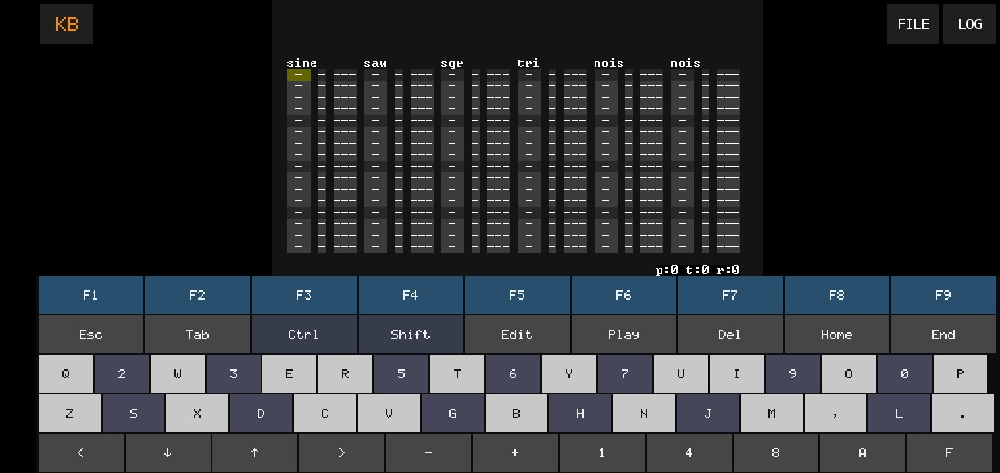
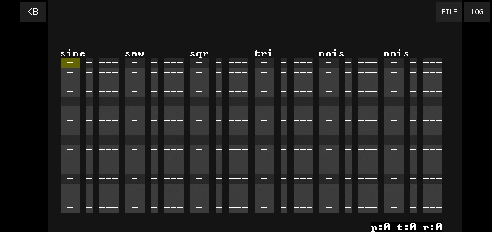
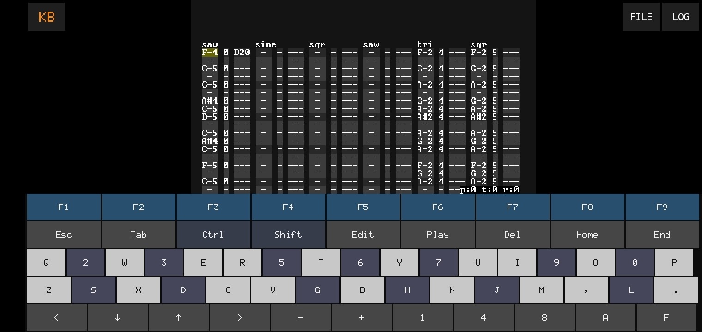
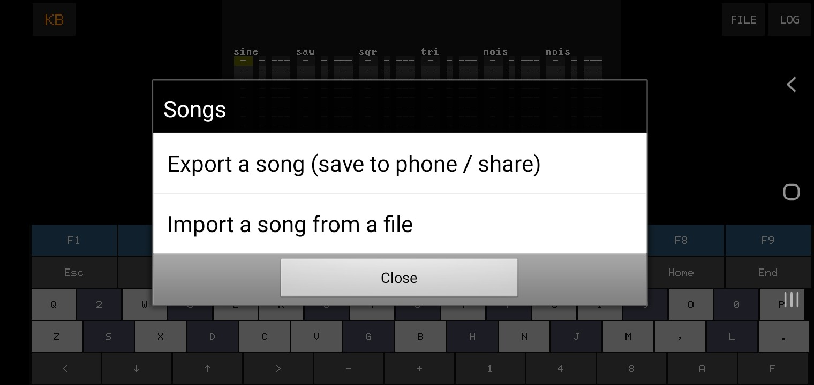

# SnibbX

**Unofficial, experimental Android port of [snibbetracker](https://github.com/lundstroem/snibbetracker)** —
a fakebit / chiptune music tracker written in C with SDL2 by Harry Lundström.

This is **not** an official release and is not affiliated with the original author. It exists to
see whether the unmodified tracker engine could be made to run on a phone, driven entirely by
touch, with no keyboard or mouse.

  
  

  
  

## What works

- The engine itself is untouched (see [`NOTICE.md`](NOTICE.md)) — same sound engine, same file
  format, same demo songs as upstream.
- **On-screen keyboard**: a command row (F1–F9, Ctrl, Shift, Edit, Play, Del, Home, End, arrows),
  plus a two-row piano laid out like the original PC keyboard shortcuts. Ctrl and Shift are
  "sticky" — tap once to arm, then tap the next key; multi-touch chords work.
  Tap the **KB** button (top-left) to hide/show the keyboard and give the tracker view the full
  screen.
- **Save / load** inside the app, exactly as on desktop (`Ctrl+S`, `Ctrl+O`).
- **Export / Import** songs to/from the rest of the phone via **FILE** (top-right): Export opens
  Android's own "save to…" screen (Downloads, Drive, a USB stick, anywhere); Import opens the
  system file picker and validates the file before adding it, so a wrong file can't corrupt the
  song list.
- **In-app log viewer** (**LOG**, top-right): every run's log, plus the last crash if there was
  one, viewable and copyable without a computer — tap it, then *Copy* or *Share*.
- Runs on `armeabi-v7a`, `arm64-v8a`, `x86`, and `x86_64` — see [Downloads](#downloads).

## What's missing / known limitations

- No sound-export-to-file UI beyond what the engine itself provides.
- The on-screen keyboard's note layout mirrors the original PC keyboard mapping; it isn't (yet)
  optimized specifically for touch ergonomics beyond key sizing.
- Only tested on a handful of real devices so far (see commit history / issues for which ones).
- Debug-signed builds only — see [Building it yourself](#building-it-yourself) if you want a
  release-signed APK.

## Downloads

Prebuilt APKs are published under this repository's **[Releases](../../releases)** tab, one file
per CPU architecture (pick the one matching your device — most phones from the last several years
are `arm64-v8a`; older or budget phones are often `armeabi-v7a`; `x86`/`x86_64` are for emulators
and some Chromebooks):

| File | For |
|---|---|
| `SnibbX-armeabi-v7a-debug.apk` | Most 32-bit ARM phones |
| `SnibbX-arm64-v8a-debug.apk`   | Most modern (64-bit ARM) phones |
| `SnibbX-x86-debug.apk`         | 32-bit x86 emulators |
| `SnibbX-x86_64-debug.apk`      | 64-bit x86 emulators, some Chromebooks |

These are debug builds (unsigned for release), meant for trying the port out. Android will ask you
to allow installs from your browser/file manager the first time.

## Controls

| On-screen key | Does |
|---|---|
| Piano rows | Play notes / enter them into the pattern (when editing is on) |
| `Edit` | Toggle edit mode on/off (same as `Return` on desktop) |
| `Play` | Play / stop (same as `Space`) |
| `Ctrl`, `Shift` | Sticky modifiers — tap to arm, then tap the key you want modified |
| `F1`–`F9` | Switch views (song, pattern, track, instrument, wavetable, etc.) |
| `Home` / `End` | Jump to top / bottom |
| `+` / `-` | Transpose a note up/down a semitone |
| `KB` (top-left) | Hide/show the on-screen keyboard |
| `FILE` (top-right) | Export the current song out of the app, or import one from a file |
| `LOG` (top-right) | View the current log, or the last crash if one happened |

Everything else follows the original desktop shortcuts — see the tracker's own in-app help (`F1`
often shows a help/track view with the current key bindings).

## Building it yourself

The Android project lives in `android/`, the (mostly unmodified) engine in `snibbetracker/`, and a
GitHub Actions workflow (`.github/workflows/build-apk.yml`) assembles them against a pinned SDL2
release, builds all four ABIs as separate APKs, and publishes them as a GitHub Release.

To build locally instead: copy `android/jni`, `android/java`, `android/res`, and
`android/AndroidManifest.xml` into a copy of
[SDL's own `android-project` template](https://github.com/libsdl-org/SDL/tree/main/android-project),
following the exact steps in `.github/workflows/build-apk.yml`'s "Assemble Android project" step,
then build with Gradle as usual (`./gradlew assembleDebug`).

## Tests

Parts of this port that don't need a phone to verify (song-name sanitizing, import validation, the
touch keyboard's hit-testing and sticky-modifier logic) have unit tests you can run on a plain
computer — see [`tests/README.md`](tests/README.md).

## License

Three separate MIT-licensed parts are combined here — the original engine (Harry Lundström), the
bundled `cJSON` library (Dave Gamble), and the Android port additions (A-C). See
[`LICENSE`](LICENSE) for the full text and [`NOTICE.md`](NOTICE.md) for exactly which files belong
to which copyright.
